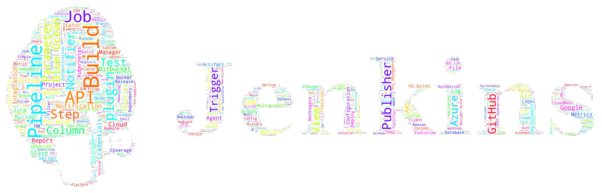

# Jenkins Plugins Word Cloud
Generate word cloud for jenkins plugins.

# Word Cloud Preview

# Usage

## Step1. download update-center.json

The `update-center.json` can be downloaded from [update-center.json](https://updates.jenkins-ci.org/current/update-center.json).

## Step2. install python modules

Install python modules with pip: `pip install -r requirments.txt`.

## Step3. generate jenkins-plugins.txt

Execute the `generate-jenkins-plugins-txt.py` script to generate `jenkins-plugins.txt`.

## Step4. generate word-cloud.png

Execute the `genarate-word-cloud.py` script to generate `word-cloud.png`.
